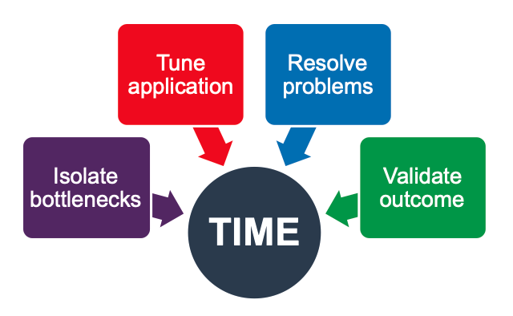
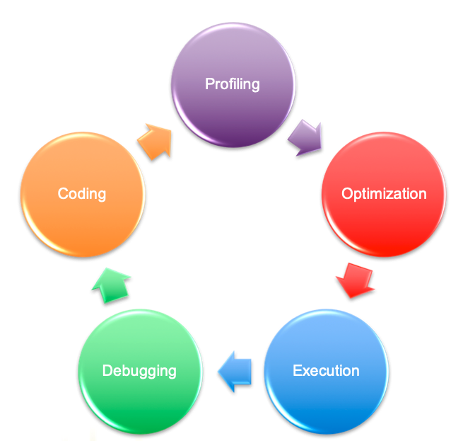
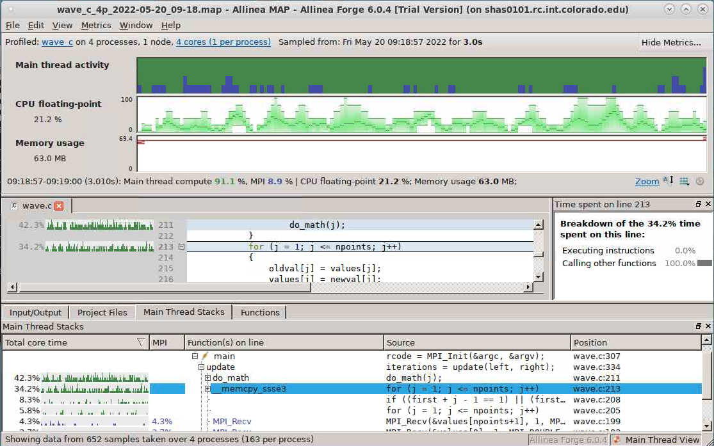
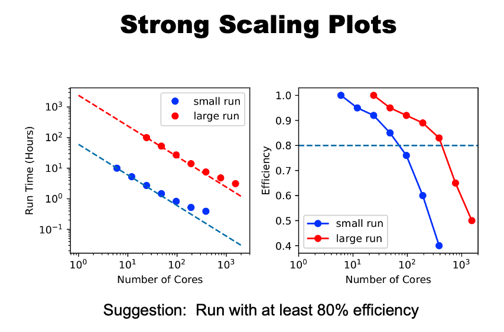
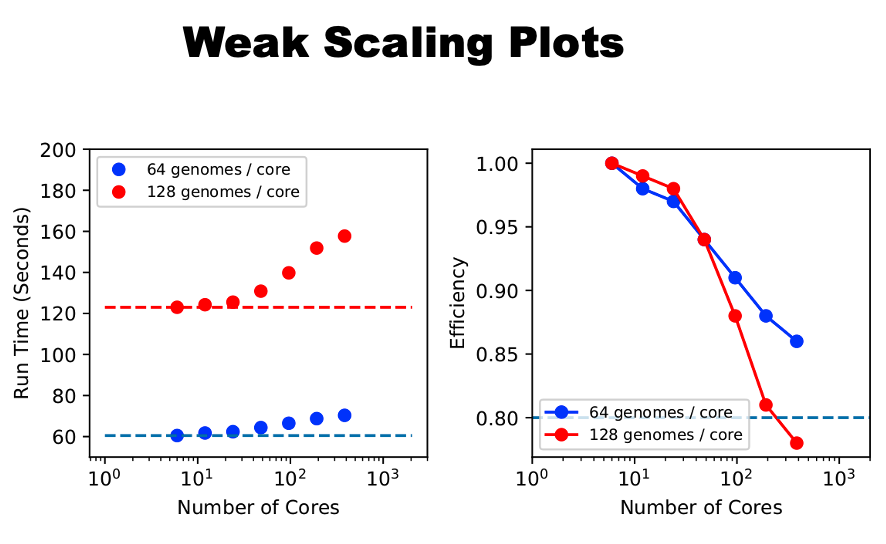

# Tutorial: A Quick Start to Profiling and Scaling 

## Objectives: 

_To gain a beginners understanding of:_

* What code __profiling__ is and how to get started
* What code __scaling__ is and how to get started

---

## Profiling

### _Profiling is measuring the performance of your code_


#### _Goal_: identify issues and rectify them so that code runs faster:


 
###### Source: Allinea


#### Profiling is part of the coding cycle:




###### Source: Allinea

### Incredibly Simple Profiling

Time the program externally with the Linux `time` function (_Example code can be found in `simple_examples` subdirectory_): 

```
$ time external_timing.py
```


* _Pros:_ fast, easy
* _Cons:_ Doesn't provide information about where or why bottlenecks occur
* Use cases 
  * when you already know where a bottleneck is within the code. 
  * code is relatively simple (e.g., a single-file script)

### Simple profiling 

Add timing wrappers around subsections of code (internal) (_Example code can be found in `simple_examples` subdirectory_): 

```
time internal_timing.py
```

let's inspect the code...it uses the ___python___ `time` package and some simple calls. 


* _Pros:_ also relatively fast, easy. Helps isolate where bottlenecks occur.
* _Cons:_ Doesn't provide information about why bottlenecks occur
* Use cases: 
  * when you do not know where bottleneck is
  * code is relatively simple 

### Software-based profiling

* Vendor-based software. CURC has:
  * [Arm-Forge](https://developer.arm.com/Tools%20and%20Software/Arm%20Forge) (formerly Allinea)
  * Intel: [VTune](https://www.intel.com/content/www/us/en/develop/documentation/vtune-help/top.html) (basic profiling), [Advisor](https://www.intel.com/content/www/us/en/develop/documentation/get-started-with-advisor/top.html) (vectorization/threading), [Trace Analyzer](https://www.intel.com/content/www/us/en/develop/documentation/get-started-with-itac/top.html) (MPI)
* Community-based software that you can download for free, install on your own
  * [GNU Profile](https://ftp.gnu.org/old-gnu/Manuals/gprof-2.9.1/html_mono/gprof.html) (`gprof`)
  * [AMD uprof](https://developer.amd.com/amd-uprof)
  * [HPC Toolkit](http://hpctoolkit.org)
  * Lots of others: [Oprofile](https://oprofile.sourceforge.io/news/), [perf](https://perf.wiki.kernel.org/index.php/Tutorial#Introduction) [TAU](https://www.cs.uoregon.edu/research/tau/home.php), [Scalasca](https://www.scalasca.org)

#### Example

Let's use _arm_forge_ to profile an mpi program written in ___c___ called `wave.c`. You'll find all of the files you need in this repository.

Step 1: Start an interactive job with 4 cores. (e.g., `sinteractive -N 1 -n 4`)

Step 2: Load the modules you need:

```
module load gcc/10.2.0
module load openmpi
module load allinea
```

Step 3: In the directory where you downloaded `wave.c` 

```
make
```

Step 4: If successful, this will result in the executable `wave_c`. Run map on the executable:

```
 map --profile mpirun -np 4 ./wave_c 3
```

_this will create a summary file called `wave_c_4p_(date).map` (where (date) is today's date)_

Step 5: Now view the output to identify bottlenecks (requires X11-forwarding)

```
map wave_c_4p_2022-05-20_09-18.map
```

_which will produce an interactive screen that looks like this:_
 


Now, with the results screen open, you can scroll through and find areas of the code that took the longest to run (these will be highlighted).  If you identify bottlenecks, you would then iteratively work to improve them (not covered in this tutorial). 

---

## Scaling
 
### _Scaling is running multiple iterations of a parallel application, with each iteraction using a different number of cores, and then comparing the results to determine how the _efficiency_ of the code changes with the number of cores._ 
 
#### Efficiency

`Efficiency = Expected Time /  Actual Time` where: 
* _Expected_ ("ideal") time is often taken relative to application’s serial performance, or performance at a low core count.
* _Actual_ time is the result of your scaling run.


In the real world, parallel processes are not 100% efficient due to:
* communications overhead
  * “fabric” latency 
  * processes waiting on each other 
* limitations of problem size
* limitations of what parts of the code can be parallelized (Amdahl’s law)
 
* therefore, we scale code to find optimal efficiency for our situation
   * If operational application (weather forecast), you want to find the optimal efficiency that enables the job to be completed in time for the product deadline.  You may not achieve maximum efficiency. 
   * If research application (climate model projections) then you typically will strive to achieve the maximum efficiency possible, 
   * This will almost always mean running with the *fewest* cores possible while remaining under the wall clock limits on HPC (24 hours typically, on our system)
 
* Rule of thumb: >=80% efficiency is pretty good. 
* scaling is a trial-and-error process! 
* Two types of scaling
   * strong
 
 
   * weak
  


---

### Final items:

* Questions?  Email rc-help@colorado.edu

* Please consider providing feedback on this tutorial via this brief survey: http://tinyurl.com/curc-survey18

* Links to resources that informed this presentation
  * [SDSC profiling tutorial](https://education.sdsc.edu/training/interactive/hpc_user_training_2021/week7/) 
  * [U. Utah CHPC profiling slides](https://www.chpc.utah.edu/presentations/images-and-pdfs/Profiling20.pdf)
  * [Arm-Forge/Allinea profiling and debugging slides](https://www.alcf.anl.gov/files/Allinea.pdf)

* Acknowledgements
  * Alpine is jointly funded by the University of Colorado Boulder, the University of Colorado Anschutz, Colorado State University, and the National Science Foundation.
  * Summit is supported by the National Science Foundation (awards ACI-1532235 and ACI-1532236), the University of Colorado Boulder, and Colorado State University.
  * Blanca is jointly funded by computing users and the University of Colorado Boulder.
  * XDMoD is funded under NSF grant numbers ACI 1025159 and ACI 1445806.
